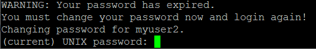

<https://greendaygh.github.io/fieldresearch2021-2/>

# 강의목표

본 현장연구에서는 합성생물학 연구에 필요한 컴퓨터 관련 지식의 학습과 실습을 통해서 관련 데이터의 수집과 변환, 가시화 그리고 분석 능력을 습득하는 것에 목적이 있음. 특히 개인별 연구 주제에 따라서 필요한 컴퓨팅 기술들을 정리하고 각 기술들에 대해서 짧은 테크니컬 노트 수준의 보고서들을 작성하는데 목적이 있음.

# 운영방식

-   각 수강생들의 학위과정 동안의 주요 연구 주제와 연계한 수업임을 고려한 각 수강생별 연구주제 토의 및 선정
-   선정된 연구주제 중 컴퓨터 활용 관련한 기술을 정리하고 개인 수준별 타깃 기술 선정 및 목표를 수립함
-   선정된 타깃 기술에 대해서 수강생들의 실습 발표 위주의 진행하며 다른 수강생 및 지도교수의 코드 지도
-   필요한 경우 온라인 수업 툴을 활용함
-   연구 데이터 분석에 직접적으로 필요한 기술 위주로 진행하며 이를 위해 필요한 기반 기술 (리눅스 활용 등)은 필요한 경우 설명\
-   Docker 이미지 활용 (개인컴퓨터 활용 가능)
-   출석50%, 과제50%
-   각 수강생별로 본인의 연구와 관련된 간단한 도표 및 정리 문서 등이 수업의 목표에 따라서 과제로 나갈 수 있음
-   테크니컬 리포트는 길이에 따라서 1건 이상이 될 수도 있음
-   가능한 명확하고 짧은 길이의 리포트가 선호됨
-   과제물은 Rmarkdown을 활용한 pdf 형식의 문서로 제출함을 원칙으로 함

# 일정

-   1주 - 강의 개요 및 연구 주제 토의
-   2주 - 각 수강생들의 연구 주제 발표 및 컴퓨팅 기술 도출
-   3주 - 연구 주제에 따른 기술 워크플로우 작성 및 토의
-   4주 - 각 기술별 필요한 세부 컴퓨팅 기술 도출
-   5주 - 수강생별 담당 컴퓨팅 기술 선정
-   6주 - 기술 학습/실습/운영 위한 기반 docker 설치 및 학습
-   7주 - 수강생별 기술 학습 및 실습 1\~4
-   11주 - 테크니컬 노트 중간 정리\
-   12\~15주 - 수강생별 기술 학습 및 실습 5\~8
-   16주 - 테크니컬 노트 최종 정리

# 수업 (20210902)

## 주제선정

각자 한 학기동안 연구를 통해서 만들어볼 기술문서에 대한 주제 선정

-   허성보: Linux + docker (Seongbo)

    -   Objective: To build Rstudio env

-   박아영: R language (A-young)

    -   ~~Objective: BT Codon design~~

-   성원재: ~~Tensorflow, Keras (Wonjae)~~ R based data analysis

    -   Objective: ~~To build tensorflow models (data)~~

-   아포바: Shiny, R package (Aporva)

    -   Objective: To build R (shiny) interface for dsembler-script (Database)

-   박성군: ~~PDB, NCBI DB API (SeongKun)~~ Shiny

    -   Objective: ~~Download and preprocessing (FACS screening)~~

-   고민지: Rstudio (Minji)

    -   Objective: Load data and plot graphs

## 구현 방법

위 목표 구현을 위한 필요 사항

-   We'll use Cloud based Rstudio
-   Once create an account, it'll ready to use Rstudio
-   Rmarkdown for report (Rmarkdown study)
-   Homework ? Create a Rmarkdown file after login Rstudio

## Rstudio 접속방법

1.  터미널 접속을 통한 계정 생성 (강사나 Aporva 등 도움)

-   KRIBB ID와 동일 ID 계정 생성 (카톡 발신 예정)
-   putty [다운로드](https://the.earth.li/~sgtatham/putty/latest/w64/putty-64bit-0.76-installer.msi)
-   설치/실행 후 접속 (Session -\> Host name에 IP, Port에 8022 입력)
-   주어진 계정으로 터미널 로그인
-   로그인 후 패스워드 변경 (로그인 하면 다음 그림처럼 자동 변경 요청)
-   패스워드 변경 후 카톡이나 메일로 변경 알림



2.  브라우저로 Rstudio 접속

-   브라우져 오픈
-   주소창에 공지된 IP 입력 (카톡 발신 예정)
-   설정된 계정으로 Rstudio 로그인

# 수업 (20210913)

## 사전 공지

월요일 10시 수업 관련해서 간단히 지금 하는 일들 ppt 2\~3장으로 (5분 발표) 준비해 주시고 지난번 계획한 일들 진행을 어떻게 할지 다시 한 번 생각해 보세요

그리고 클라우드 계정은 보안 이슈로 단분간 사용하기 어려울 것 같습니다. 대신 우리 192.168.122.158 서버를 Linux/Rstudio 사용합니다. 연구원 내에서만 접속이 가능하며 월요일에 계정 등 사용법을 설명 드리겠습니다.

## Rstudio 접속방법

1.  터미널 접속을 통한 계정 생성

-   KRIBB ID와 동일 ID 계정 생성
-   putty [다운로드](https://the.earth.li/~sgtatham/putty/latest/w64/putty-64bit-0.76-installer.msi)
-   설치/실행 후 접속 (Session -\> Host name에 192.168.122.158, Port에 8022 입력)
-   주어진 계정으로 터미널 로그인
-   로그인 후 패스워드 변경 (로그인 하면 다음 그림처럼 자동 변경 요청)
-   패스워드 변경 후 카톡이나 메일로 변경 알림


2.  브라우저로 Rstudio 접속

-   브라우져 오픈
-   <http://192.168.122.158:8788> 입력
-   앞서 설정된 계정으로 Rstudio 로그인

# 수업 (20210920)

연구 발표

# 수업 (20210927)

연구 발표

# 수업 (20211004)

연구 발표

# 수업 (20211018)

연구 발표

# 수업 (20211025)

연구 발표

# 수업 (20211101)

## Nanopore sequencing pipeline

박성군 연구원 NGS pipeline 발표


## DNA PCA 실험

```{css, echo=F}
#protocol {
  background-color: #F8F8FF;
  padding: 30px;
}
```


::: {#protocol}

<h4> 2개 샘플 수행 기준 PCA 프로토콜 </h4>

## DNA 준비 희석{-}

재료: 아이스, KOD-one, 샘플 (2개 기준), 1.5ml tube 7개, 3DW

-   DNA polymerase KOD-one 꺼내 아이스에 넣어둠
-   50pmol powder 상태 DNA 샘플을 vortexing 후 spindown 2초
-   샘플에 3DW 10 $\mu$l 를 넣고 vortexing 후 spindown 2초
-   1/10, 1/50, 1/100 농도 희석용 1.5ml tube 6개 준비 (2개 샘플)
-   원액 1 $\mu$l를 각각 1/10, 1/50 에 넣고 vortexing, spindown
-   1/10 샘플 1 $\mu$l를 1/100에 넣고 vortexing, spindown

## PCA{-}

재료: PCR tube 8개, 3DW

-   1.5ml tube에 KOD-one 100 $\mu$l, 3DW 90 $\mu$l 넣고 vortexing
-   PCR tube 8개 준비
-   각 tube에 위 KOD 희석액 19 $\mu$l 분주
-   각 tube에 원액, 1/10, 1/50, 1/100 샘플 1 $\mu$l를 분주 (20 $\mu$l 채움)
-   vortexing 후 Thermal cycler 수행 (AY, PCA 프로토콜)
    -   94도 10초
    -   Denaturation: 94도 10초
    -   Annealing: 55도 20초 (lamprate -0.1/도)
    -   Extension: 72도 20초 (kb당 5\~10초, 1.5kb 기준)
    -   Cycle: 20 cycle
    -   Final extension: 72도 3분

## PCR{-}

재료: PCR용 primer 2set, PCR tube 8, 3DW

-   Primer dry 샘플에 (20mer 기준) 300 $\mu$l 넣고 vortexing spindown
-   1.5ml tube에 3DW 228 $\mu$l + 두 개의 primer 각각 1 $\mu$l를 넣음
-   PCR tube 8개 준비
-   각 tube에 위 혼합액 23 $\mu$l 분주
-   각 tube에 KOD 혼합액 25 분주
-   PCA product 2 $\mu$l 분주
    -   98도 10초
    -   Denaturation: 98도 10초
    -   Annealing: 55도 5초
    -   Extension: 72도 20초 (kb당 5\~10초, 1.5kb 기준)
    -   Cycle: 30 cycle
    -   Final extension: 68도 1분
    -   4도 무한

-   완료 시 PCR, PCA 각 8개 PCR tube

## Gel QC{-}

재료: 1.5ml tube, Bluejuice 10x, 3DW, PCR tube 8개, 아가로즈 젤

-   젤 준비 (17 칸)
-   1.5 ml tube에 Bluejuice 10x 10 $\mu$l와 3DW 70 $\mu$l를 섞음
-   PCR tube 8개에 각각 8 $\mu$l 분주
-   PCR tube 8개에 앞서 PCA product 2 $\mu$ 분주
-   위 PCR Product 8개 튜브에 Bluejuice 5 $\mu$l 분주
-   가운데 lane Ladder 로딩
-   Ladder 기준으로 왼쪽 한 샘플, 오른쪽 다른 샘플 각각 PCA, PCR 순서로 로딩
-   130v 20분 전기영동
-   사진 확인

:::


# 수업 (20211108)

DNA PCA 실험 2nd

# 수업 (20211111)

온라인수업: <https://www.remotemeeting.com/reservation/share/2c908ad67cea7782017d0902b318133f>

## Rstudio 접속

1.  터미널 접속을 통한 계정(비번) 생성

-   KRIBB ID와 동일 ID 계정 생성
-   putty [다운로드](https://the.earth.li/~sgtatham/putty/latest/w64/putty-64bit-0.76-installer.msi)
-   설치/실행 후 접속 (Session -\> Host name에 192.168.122.158, Port에 8022 입력)
-   주어진 계정으로 터미널 로그인
-   비번은 모두 동일 (research2)
-   로그인 후 패스워드 변경 (로그인 하면 다음 그림처럼 자동 변경 요청)

 - 로그아웃 (창닫기, Ctrl+D)

2.  브라우저로 Rstudio 접속

-   브라우져 오픈
-   <http://192.168.122.158:8788> 입력
-   앞서 설정된 계정으로 Rstudio 로그인

3.  화면 구성

## 프로젝트

File \> New project

## Rmarkdown 활용

Rmakrdown은 Rstudio의 강의를 [링크](https://rmarkdown.rstudio.com/lesson-1.html){target="blank"} 참고하며 Markdown은 Pandoc의 문법을 [링크](https://rmarkdown.rstudio.com/authoring_pandoc_markdown.html){target="blank"} 참고.

Rstudio를 사용한 Rmarkdown 만드는 법을 익힘. Rstudio는 R언어 외에도 다양한 언어를 이용한 프로그래밍을 지원하며 Rstudio의 철학 중 하나는 Rmarkdown, shiny 등을 활용한 사람들과의 소통임.

-   Rstudio를 활용한 파일 업로드 및 다운로드 방법
-   Rmarkdown 작성을 위한 Visual mode 활용
-   Visual model에서 이미지, 코드블럭 넣기

```{r, eval=F}
a <- 2
b <- 3
c <- a*b
c
```

## Vector

vector는 R의 기본 데이터 구조. numeric vector, logical vector, character vector 등 저장되는 값의 타입에 따라 크게 세가지로 나눌 수 있으며 `class()` 함수를 이용해서 값의 타입을 알아낼 수 있음. `Combine function`인 `c()`를 활용하여 만들며 값을 순차적으로 붙일 수 있음.

```{r, eval=F}
v1 <- c(1, 2, 3, 4, 5)
v2 <- c("a", "b", "c", "d", "e")
class(v1)
class(v2)
```

## Data frame

데이터프레임은 매트릭스와 같은 형태로 컬럼 하나가 하나의 벡터 변수로서 각 변수들이 다른 모드의 값을 저장할 수 있음. \$ 기호를 이용하여 각 구성 변수를 참조할 수 있으며 컬럼 한 줄이 하나의 변수 이므로 새로운 변수도 컬럼 형태로 붙여 넣을 수 있음. 즉, 각 row는 샘플을 나타내고 각 column은 변수를 나타내며 각 변수들이 갖는 샘플의 개수 (row의 길이, vector 의 길이)는 같아야 함. R 기반의 데이터 분석에서는 가장 선호되는 데이터 타입으로 최근 `tidyverse` 패키지의 tibble 타입은 dataframe의 업그레이드 버전으로 볼 수 있음.

```{r, eval=F}
v_df <- data.frame(v1, v2)
v_df
class(v_df)
```

```{r, eval=F}
v3 <- c(121, 22, 31, 98, 45)
v4 <- c("teamA", "teamB", "teamC", "teamD", "teamE")
v5 <- data.frame(v1, v2, v3, v4)
v5
```

## TODO

다음 주제들에 대한 Rmarkdown 문서를 만드시오

### Dr성원재 {.unnumbered}

-   임의의 엑셀 파일 2개 이상 읽기
-   tidyverse 패키지 이용 데이터들을 병합하기
-   해당 데이터 가시화용 그래프 그리기

### 박아영 {.unnumbered}

-   엑셀 데이터 읽기
-   plot 이용한 그래프 그리기

### 박성군 {.unnumbered}

-   Shiny 이용한 app 만들기 (NGS 파이프라인 관리?)

### Aporva {.unnumbered}

-   Prepare MySQL docker image
-   Docker-compose for more than two docker images
-   To access MySQL server in R

### 허성보 {.unnumbered}

-   리눅스 디렉토리 구조 및 설명
-   vi 에디터로 파일 생성
-   Docker 이미지 만들기

### 고민지 {.unnumbered}

-   R 데이터 타입 정리
-   숫자형 벡터 만들기와 연산
-   dataframe 만들기와 인덱싱


# 수업 (2021115)

- 각자 Topic 들에 대한 스터디 및 Rmarkdown 문서 작성 진행 

# 수업 (2021118)

- 각자 Topic Rmarkdown 문서 업데이트 및 제출 

# 수업 (2021122)

- Rmarkdown 문서 점검 및 코드 재작성
- Rstudio 프로젝트 활용
- Rstudio 목차 기능 활용 (document outline)
- DNA 서열 읽고 쓰기 `Biostrings` 패키지 활용
- [pay211118](pay211118.Rmd) 강의 Rmarkdown 코드 


